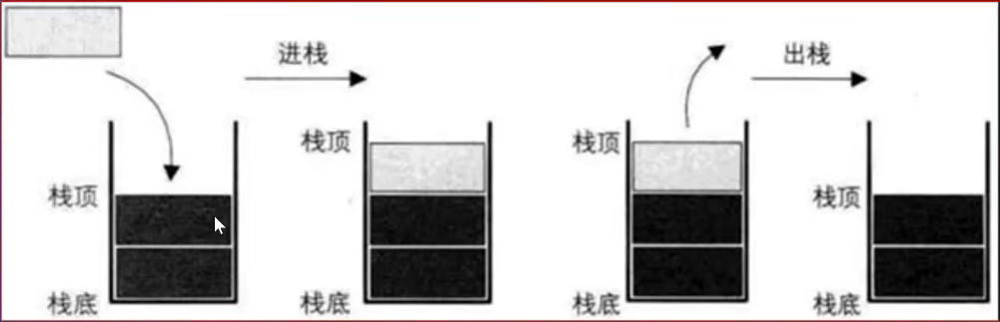
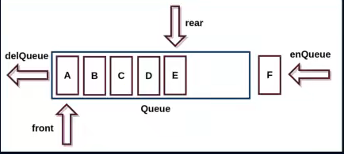
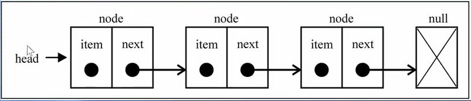
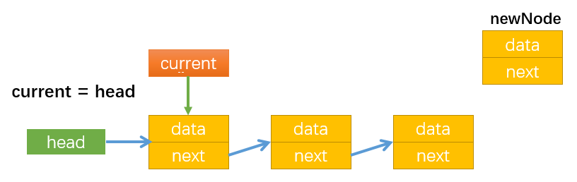
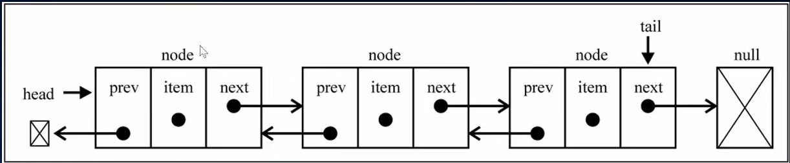
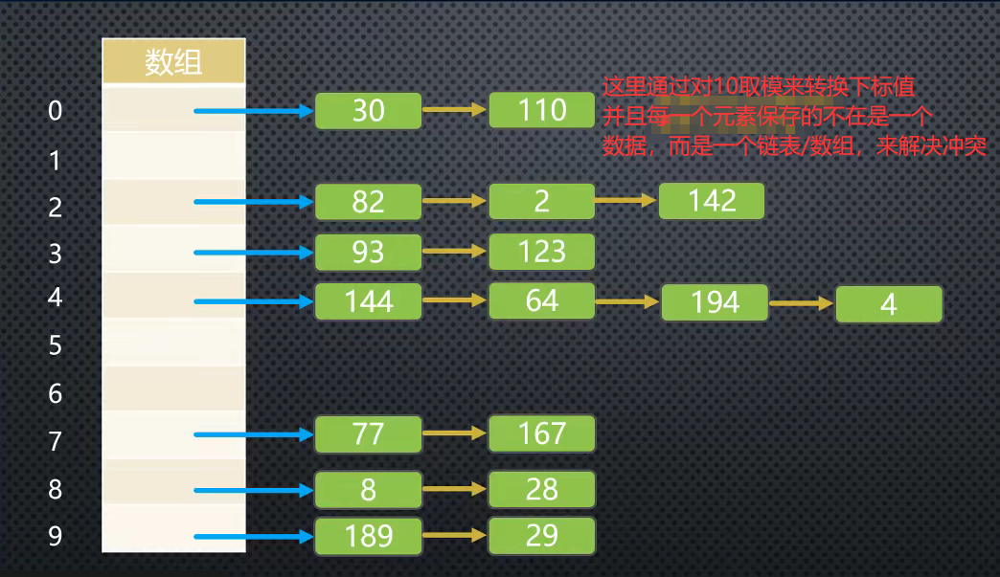
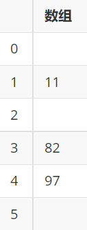
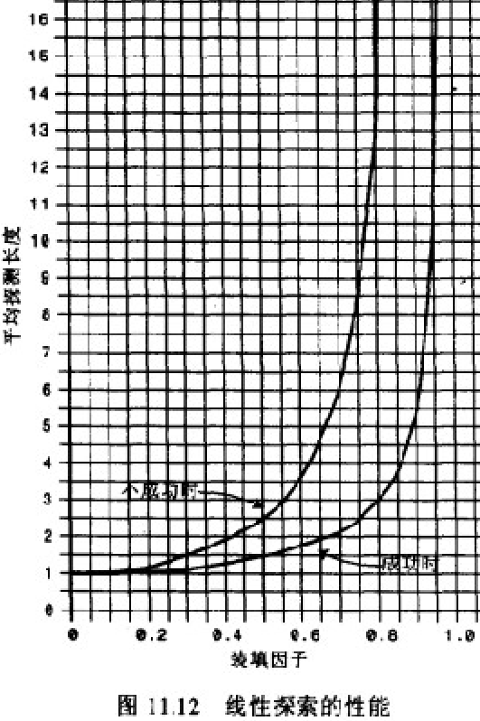
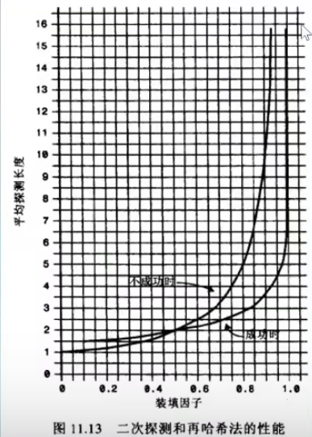
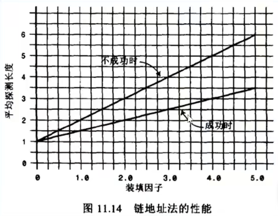

[TOC]


# 一、前言

## 1. 什么是数据结构

1. 解决问题方法的效率，根据数据的组织方式有关。
2. 计算机中存储的数据量相对于图书馆的书籍来说数据量更大，数据更加多。
3. 以什么样的方式，来存储和组织我们的数据才能在使用数据时更加方便呢?
4. 这就是数据结构需要考虑的问题。

## 2.常见的数据结构

- 数组（Aarray）
- 栈（Stack）
- 链表（Linked List）
- 图（Graph）
- 散列表（Hash）
- 队列（Queue）
- 树（Tree）
- 堆（Heap）

每一中都有对应的应用场景，==不同的数据结构==的==不同操作==性能是不同的

## 3. 什么是算法(Algorithm)

### 3.1 算法的认识

<ul>
    <li>不同的算法，执行效率是不一样的</li>
    <li>在解决问题的过程中，不仅仅数据的存储方式会影响效率，算法的优劣也会影响效率</li>
</ul>

### 3.2 算法的定义

<ul>
    <li>一个有限指令集，每条指令的描述不依赖语言</li>
    <li>接受一些输入（有时不需要输入）</li>
    <li>产生输出</li>
    <li>一定在有限步骤之后终止</li>
</ul>

# 二、数组

几乎所有的编程语言都原生支持数组类型，因为数组是最简单的内存数据结构。 数组通常情况下用于存储一系列同一种数据类型的值。 但在 JavaScript 里，数组中可以保存不同类型的值。

<dl>
    <dt>数组的缺点:</dt>
    <dd>1.常见语言的数组不能存放不同的数据类型，因此在封装时通常存放在数组</dd>
    <dd>2.常见语言的数组容量不会自动改变(需要扩容操作:申请一个更大的数组，再将原本数组中的元素复制进新的数组)</dd>
    <dd>3.常见语言的数组进行中间插入和删除操作性能比较低，因为要将后面的元素全部挪动</dd>
</dl>

**数组的优点**:==通过下标值去取元素和修改元素时效率非常高(可以直接定位到某个元素)==  ，              而链表因为是通过线性查找而导致查找元素效率低。

## 1.创建和初始化数组

### 1.1 new Array()

```javascript
const daysOfWeek = new Array(
  "Sunday",
  "Monday",
  "Tuesday",
  "Wednesday",
  "Thursday",
  "Friday",
  "Saturday"
);
```

### 1.2 字面量[]

```javascript
const dayOfWeek=[  "Sunday",
  "Monday",
  "Tuesday",
  "Wednesday",
  "Thursday",
  "Friday",
  "Saturday",];
```

## 2. 数组常见操作

### 2.1 添加元素

- 添加一个元素到数组的最后位置 `array.push(item)`
- 在数组首位插入一个元素 `array.unshift(item)`
- 在指定索引位置插入元素 `array.splice(index, 0, item)`

```javascript
array.splice(start, deleteCount, item1)
// start 开始修改的位置
//deleteCount 要删除的元素个数--从插入的元素后面开始计数
//item1 要添加的元素
```

### 2.2 删除数组

- 删除数组最后的元素 `array.pop(item)`
- 删除数组首位的元素 `array.shift(item)`
- 删除指定索引位置的元素 `array.splice(start, number)`

```javascript
let myArray2 = [1, 2, 3, 4, 5];
// 删除索引 4 位置起，2 个元素
myArray2.splice(4, 2);
console.log(myArray2); //--> [1, 2, 3, 4]
```

### 2.3 修改元素array.splice()

修改指定索引位置的元素 `array.splice(index, number, item)`

```javascript
let myArray3 = [1, 2, 3, 4, 5, 6];
// 修改 索引 1 的位置的元素为 AA
myArray2.splice(1, 1, "AA");
console.log(myArray3); //--> [1, "AA", 3, 4, 5, 6]
//其实本质上就是将AA插入到索引值为1的位置并将后面一个元素删除,若写为myArray2.splice(1, 0, "AA")，则是仅仅在索引值为1的位置上插入一个元素，其他元素后移。
```

# 三、栈(stack)

数组是一种==线性结构==，并且可以在数组的==任意位置==插入和删除数据(但是效率低)，但有时候为了实现某种功能，必须对这种==任意性==，==加以限制==，而==栈和队列==就是比较常见的==受限的线性结构==

**栈结构示意图**：



## 1.什么是栈

栈是一种受限的线性表，==后进先出(LIFO)==:

​      1.其限制是仅允许在==表的一端==进行插入和删除运算

​      2.后进先出，先进后出

​      3.向一个栈插入新元素称为==进栈、入栈或压栈==，它是把新元素放到栈顶元素的上面使之成为新的栈顶元素

​      4.从一个栈删除元素又称为==出栈和退栈==，它是把栈顶元素删除掉，使其相邻的元素成为新的栈顶元素

## 2.程序中的栈结构

(1) 函数间的互相调用：A调用B，B中又调用C，C中又调用D

<dl>
    <dt>这样在执行的过程为：</dt>
    <dd>1. 先将A压入栈,A没有执行完。就不会弹出栈</dd>
    <dd>2. 在A执行的过程中调用了B，会将B压入栈中，此时B在栈顶，A在栈底</dd>
    <dd>3. 如果B执行完就会弹出栈，但是他调用了C，所以C会压栈，且在栈顶</dd>
    <dd>4. C调用D，D又会被压入栈顶</dd>
    <dd>5. 所以当前顺序为栈底A->B->C->D栈顶</dd>
    <dd>6. D执行完毕，弹出栈而后C\B\A依次出栈</dd>
</dl>

所以有==函数调用栈==的称呼，就来自与它们内部的使用栈的实现机制。

(2)==递归==：

通过上例可知，==为什么没有停止条件的递归会造成栈溢出==？

因为若A为递归函数，不断的调用自己(但函数还没有执行完就不会把函数弹出栈)，就会不停地把相同的函数A压入栈，最后造成栈溢出==（Queue Overfloat）==。

## 3.栈结构的实现

### 3.1 栈结构有两种常见的方式：

<ul>
    <li>基于数组实现</li>
    <li>基于链表实现</li>
</ul>

### 3.2 栈的常见操作

- `push()` 添加一个新元素到栈顶位置。
- `pop()` 移除栈顶的元素，同时返回被移除的元素。
- `peek()` 返回栈顶的元素，不对栈做任何修改（该方法不会移除栈顶的元素，仅仅返回它）。
- `isEmpty()` 如果栈里没有任何元素就返回 `true`，否则返回 `false`。
- `size()` 返回栈里的元素个数。这个方法和数组的 `length` 属性类似。
- `toString()` 将栈结构的内容以字符串的形式返回。

### 3.3 栈封装与进制转换代码实现

```javascript
class map{// 栈结构的封装
        constructor(){
            this.items=[];
        }
        
        push(item){//压栈操作，往栈里面添加元素
           this.items.push(item);
        }
     
        pop(){//出栈操作，从栈中取出元素，并返回取出的那个元素
           return this.items.pop();
        }
             
        peek(){//查看栈顶元素
            return this.items[this.items.length-1];
        }

        isEmpty(){//判断栈是否为空
            return this.items.length===0;
        }
        
        size(){//获取栈中元素个数
            return this.items.size;
        }

        toString(){//返回以字符串形式的栈内元素数据
            let result = "";
            for (let item of this.items) {
                result += item + " ";
                }
            return result;
        }
        }
        
        function des2bin(num){
           var strack=new map();
           var b=0
           while(num>0){
               strack.push(num%2);
               num=Math.floor(num/2); 
               b++;   
           }    
           console.log(b);
           for(;b>0;b--){
               console.log(strack.items[b-1]);
           }
           
           let a="";
           while(!strack.isEmpty()){    
              a+=strack.pop();
           }
           return a;
          }
       
        alert(des2bin(8))
```


# 四、队列(queue)

## 1. 什么是队列

- 队列是一种受限的线性表。
- 只允许在表的前端(front)进行删除操作
- 只允许在表的后端(rear)进行插入操作
- 先进先出(FIFO First In Frist Out)

**队列结构示意图**：



## 2. 队列在程序中的应用

==线程队列==：

- 在开发中，为了让任务可以并行处理，通常会==开启多个线程==。
- 但不能让大量的线程同时运行处理任务==(占用过多资源)==。
- 这时，如有需要开启线程处理任务的情况，就可以使用==线程队列==。
- 线程队列会==按照次序==来启动线程，并处理对应的任务。

## 3. 队列的实现

### 3.1 队列的实现方法

- 基于数组实现
- 基于链表实现

### 3.2  队列常见的操作

- `enqueue(element)` 向队列尾部添加一个（或多个）新的项。
- `dequeue()` 移除队列的第一（即排在队列最前面的）项，并返回被移除的元素。
- `front()` 返回队列中的第一个元素——最先被添加，也将是最先被移除的元素。队列不做任何变动（不移除元素，只返回元素信息与 Map 类的 peek 方法非常类似）。
- `isEmpty()` 如果队列中不包含任何元素，返回 true，否则返回 false。
- `size()` 返回队列包含的元素个数，与数组的 length 属性类似。
- `toString()` 将队列中的内容，转成字符串形式。

### 3.3 队列封装代码实现

```javascript
        class map{//  队列结构的封装
        items=[];
        
        enqueue(item){//入队操作，往队尾添加元素
           this.items.push(item);
        }
     
        dequeue(){//出队操作，从队首取出元素，并返回取出的那个元素
           return this.items.shift();
        }
             
        front(){//查看队首元素
            return this.items[0];
        }

        isEmpty(){//判断队列是否为空
            return this.items.length===0;
        }
        
        size(){//获取队列中元素个数
            return this.items.size;
        }

        toString(){//返回以字符串形式的队列元素数据
            for(let i=0;i<this.items.length;i++){
             return " "+this.items[i]+" ";
            }
        }
        }

//击鼓传花 规则获得一组数组 里面存是几名玩家的名字 以及 一个数字 每次数到这个数就淘汰这个人  并获得这个人的名字和原本的位置
       function passgame(nameList,num){
           var queue=new map();
          
           for(let i=0;i<nameList.length;i++){//人名依次进入队列
                queue.enqueue(nameList[i])
           }
           
           while(queue.size()>1){//直到最后一个人时退出循环
             for(let j=0;j<num-1;j++){
                 queue.enqueue(queue.dequeue());//循环 num 次 将前几次的人名重新放入队列尾部
             }
             queue.dequeue();//将队首元素删除，变相做到删除对应num人名
           }

           let endName=queue.front();//获得最后一个人的名字
           return  nameList.indexOf(endName);//获得最后一个人的名字索引

        }
        let nameList=["guo","chen","xie","zhang","ma","liu"];
        let a= passgame(nameList,2);
        alert(a+nameList[a]);
```

# 五、优先级队列

## 1. 优先级队列的特点

- 普通的队列==插入一个元素==，数据会被放在==后端==，并且需要将前面所有的元素都处理完成后才会处理前面的数据。
- 而优先级队列，在插入一个元素时会==考虑该数据的优先级==。并与其他数据优先级==进行比较==，比较完成后得出这个元素在队列中==正确的位置==，之后则与普通队列一致。

### 1.1 优先级队列主要考虑的问题：

- 每个元素不再是一个数据，而且包含数据的优先级
- 在添加方式中，根据优先级放入正确的位置

## 2.优先级队列在程序中的应用

如在每个线程处理的任务重要性不同，我们可以通过优先级的大小，来决定该线程在队列中被处理的次序

## 3.优先级队列的实现

### 3.1实现优先级队列相对队列要考虑两点：

1. 封装元素和优先级放在一起（可以封装一个新的构造函数）
2. 在添加方式中，根据优先级放入正确的位置

### 3.2 代码实现-使用内部类

```javascript
 class PriorityQueue {//  队列结构的封装             

            QueueElement = class { //内部类
                constructor(element, priority) {
                    this.element = element;
                    this.priority = priority;
                }
            }

            items = [];
            enqueue(element, priority) {
                var queueElement = new this.QueueElement(element, priority);
                if (this.items.length == 0) {
                    this.items.push(queueElement)
                } else {
                    let added = false;//用于判断当经过一轮比较之后任然没有找到,优先级值更小的情况
                    for (let i = 0; i < this.items.length; i++) {
                        // 让新插入的元素进行优先级比较，priority 值越小，优先级越大
                        if (this.items[i].priority > queueElement.priority) {
                            this.items.splice(i, 0, queueElement);
                            added = true;
                            break;
                        }
                    }
                    if (!added) {
                        this.items.push(queueElement);
                    }
                }
            }


            dequeue() {//出队操作，从队首取出元素，并返回取出的那个元素
                return this.items.shift();
            }

            front() {//查看队首元素
                return this.items[0];
            }

            isEmpty() {//判断队列是否为空
                return this.items.length === 0;
            }

            size() {//获取队列中元素个数
                return this.items.length;
            }

            toString() {//返回以字符串形式的队列元素数据
                let result = "";
                for (let i = 0; i < this.items.length; i++) {
                    result += this.items[i].element + '-' + this.items[i].priority;
                    return result;
                }
            }

        }

        var priorityQueue = new PriorityQueue();

        // 入队 enqueue() 测试
        priorityQueue.enqueue("A", 10);
        priorityQueue.enqueue("B", 15);
        priorityQueue.enqueue("C", 11);
        priorityQueue.enqueue("D", 20);
        priorityQueue.enqueue("E", 18);
        console.log(priorityQueue.items);
        priorityQueue.dequeue();
        console.log(priorityQueue.items);

```

# 六、单向链表

链表和数组一样,可以用于存储一系列的元素,但是链表和数组的实现机制完全不同

数组:
要存储多个元素，数组（或称为列表）可能是最常用的数据结构。几乎每一种编程语言都有默认实现数组结构.。

数组缺点:

1. 数组的创建通常需要申请==一段连续的内存空间(一整块的内存)==并且大小是固定的(大多数编程语言数组都是固定的),所以当当前数组==不能满足容量需求时==,需要扩容.(一般情况下是申请一个更大的数组,比如2倍.然后将原数组中的元素复制过去)

2. 在数组开头或中间位置插入数据的成本很高，需要进行大量元素的位移.

3. JavaScript的Array类方法可以帮我们做这些事，但背后的原理依然是这样。

## 1. 什么是链表：

链表是储存多个元素的另一种选择

链表不同于数组，链表中的元素在内存中==不必是连续的空间==。

链表的每个元素由一个==存储元素本身的节点==和一个==指向下一个元素的引用==组成。

示意图：



## 2. 链表的优势与缺点

### (1)优点

1. 内存空间不是必须连续，可以充分利用计算机的内存，实现灵活的==内存动态管理==。
2. 链表不必在创建时就确定大小，并且可以==无限的延伸==下去。
3. 链表在==插入和删除数据==时，==时间复杂度==可以达到O(1)，相对数组效率高很多。

### (2)缺点

1. 链表访问任何一个位置的元素时,都需要从头开始访问.(无法跳过第一个元素访问任何一个元素).
2. 无法通过下标直接访问元素,需要从头一个个访问,直到找到对应的元素.

## 3. 链表的常见操作

- `append(element)` 向链表尾部添加一个新的项。
- `insert(position, element)` 向链表的特定位置插入一个新的项。
- `get(position)` 获取对应位置的元素。
- `indexOf(element)` 返回元素在链表中的索引。如果链表中没有该元素就返回-1。
- `update(position, element)` 修改某个位置的元素。
- `removeAt(position)` 从链表的特定位置移除一项。
- `remove(element)` 从链表中移除一项。
- `isEmpty()` 如果链表中不包含任何元素，返回 trun，如果链表长度大于 0 则返回 false。
- `size()` 返回链表包含的元素个数，与数组的 length 属性类似。
- `toString()` 由于链表项使用了 Node 类，就需要重写继承自 JavaScript 对象默认的 toString 方法，让其只输出元素的值。

## 4. 代码实现

插入函数图解：

(1)首先让 `current` 指向第一个节点。



(2)通过 `while` 循环使 `current` 指向最后一个节点，最后通过 `current.next = node`，让最后一个节点指向新节点 `node`。


完整代码：

```javascript
       class LinkedList {//  链表结构的封装             
            head = null;
            length = 0;

            Node = class {//内部类
                constructor(data) {
                    this.data = data;
                    this.next = null;
                }
            }

            append(data) {
                var node = new this.Node(data);
                if (this.length == 0) {
                    this.head = node;//这里使头指针指向了第一个节点
                } else {
                    let current = this.head //创建一个指针指向头节点
                    while (current.next) {//判断指针当前所指节点的next是否为空，不为空则指向下一个节点,一直指到最后一个节点为止
                        current = current.next;
                    }
                    current.next = node;//使最后一个节点指向 新的节点
                }
                this.length++;
            }


            insert(position, data) {
                var node = new this.Node(data);
                if (position < 0 || position > this.length) { return false; }
                //判断插入位置来对应处理
                if (position == 0) {
                    node.next = this.head;//将node.next指向原本head指向的节点
                    this.head = node;//将head重新指向新节点
                } else {
                    var current = this.head;
                    var previous = null;   //用来指向前一个节点
                    var index = 0;
                    while (index++ < position) {//使当前指针指向目标位置节点 ，如position==1，则循环一次指向了索引为1的节点
                        previous = current;
                        current = current.next;
                    }
                    node.next = current;
                    previous.next = node;
                }
                length++;
                return true;
            }

            get(position) {//获取数据
                if (position < 0 || position >= this.length) { return null; }
                let current = this.head;
                let index = 0;
                while (index++ < position) {
                    current = current.next;
                }
                return current.data;

            }

            indexof(data) {//获取元素下标值
                let current = this.head;
                let index = 0;
                do {
                    if (current.data == data) {
                        return index;
                    }
                    current = current.next;
                } while (index++ < this.length - 1)
                return -1;
            }

            updata(position, data) {//修改数据
                if (position < 0 || position >= this.length) { return null; }
                let current = this.head;
                let index = 0;
                while (index++ < position) {
                    current = current.next;
                }
                current.data = data;
                return true;
            }

            removeAt(position) {//删除指定位置的一项
                if (position < 0 || position >= this.length) { return null; }
                var current = this.head;
                if (position == 0) {
                    this.head = this.head.next;
                } else {
                    var previous = null;   //用来指向前一个节点
                    var index = 0;
                    while (index++ < position) {//使当前指针指向目标位置节点 ，如position==1，则循环一次指向了索引为1的节点
                        previous = current;
                        current = current.next;
                    }
                    previous.next = current.next;
                }
                this.length--;
            }

            remove(data) {//删除指定数据
               return this.removeAt(this.indexof(data));
            }

            isEmpty(){
                if(this.length==0){
                      return true;
                }else{
                    return false;
                }
            }
           
            size(){
                return this.length;
            }

            toString() {
                var listString = "";
                var current = this.head
                while (current) {
                    listString += current.data + '';
                    current = current.next;
                }

                return listString;
            }


        }

        const linkedList = new LinkedList();
        // 测试 append 方法
        linkedList.append("A");
        linkedList.append("B");
        linkedList.append("C");
        linkedList.append("A");
  

        linkedList.remove("B")
        console.log(linkedList);
```

# 七、双向链表

## 1.什么是双向链表

### 1.1 单向链表的缺点

单向链表：

- 只能从头遍历到尾或者从尾遍历到头(一般从头到尾)
- 链表相连的过程是单向的.
- 实现的原理是上一个链表中有一个指向下一个的引用.

单向链表的缺点：

- 我们可以轻松的到达下一个节点,但是回到前一个节点是很难的.但是,在实际开发中,经常会遇到需要回到上一个节点的情况

例子:

- 假设一个女本编辑用链表来存储文本.每一行用一个String对象存储在链表的一个节点中.当编辑器用户向下移动光标时,链表直接操作到下一个节点即可.但是当用于将光标向上移动呢?这个时候为了回到上一个节点,我们可能需要从first开始,依次走到想要的节点上.

### 1.2 双向链表的优点

- 既可以==从头遍历到尾,又可以从尾遍历到头==,也就是链表相连的过程是双向的.
- 一个节点既有==向前连接的引用==,也有一个==向后连接的引用==.
- 双向链表可以有效的解决单向链表中提到的问题.

### 1.3 双向链表的缺点

- 每次在==插入或删除某个节点时，需要处理四个引用==,而不是两个.
- 并且相当于单向链表,必然占用内存空间更大一些.[==需要多一部分空间存储上个节点的引用==]

示意图：



## 2. 双向链表常用方法

- `append(element)` 向链表尾部追加一个新元素。
- `insert(position, element)` 向链表的指定位置插入一个新元素。
- `getElement(position)` 获取指定位置的元素。
- `indexOf(element)` 返回元素在链表中的索引。如果链表中没有该元素就返回 -1。
- `update(position, element)` 修改指定位置上的元素。
- `removeAt(position)` 从链表中的删除指定位置的元素。
- `remove(element)` 从链表删除指定的元素。
- `isEmpty()` 如果链表中不包含任何元素，返回 `trun`，如果链表长度大于 0 则返回 `false`。
- `size()` 返回链表包含的元素个数，与数组的 `length` 属性类似。
- `toString()` 由于链表项使用了 Node 类，就需要重写继承自 JavaScript 对象默认的 `toString` 方法，让其只输出元素的值。
- `forwardString()` 返回正向遍历节点字符串形式。
- `backwordString()` 返回反向遍历的节点的字符串形式

## 3. 代码实现

```javascript
 class DoublyLinkedList {//  双向链表结构的封装             
            head = null;
            tail = null;
            length = 0;

            DoublyNode = class {//内部类
                constructor(data) {
                    this.previous = null;
                    this.data = data;
                    this.next = null;
                }
            }

            append(data) {
                var node = new this.DoublyNode(data);
                if (this.length == 0) {
                    this.head = node;//这里使头指针指向了第一个节点
                    this.tail = node;//使尾指针指向第一个节点
                } else {
                    this.tail.next = node;//直接通过尾指针找到最后一个节点
                    node.previous = this.tail;
                    this.tail = node;
                }
                this.length++;
            }


            insert(position, data) {
                var node = new this.DoublyNode(data);
                if (position < 0 || position > this.length) { return false; }
                //判断插入位置来对应处理
                if (this.length == 0) {
                    this.head = node;
                    this.tail = node;
                } else {
                    if (position == 0) {
                        this.head.previous = node;
                        node.next = this.head;//将node.next指向原本head指向的节点
                        this.head = node;//将head重新指向新节点
                    } else if (position == this.length) {
                        this.tail.next = node;//直接通过尾指针找到最后一个节点
                        node.previous = this.tail;
                        this.tail = node;
                    } else {
                        var current = this.head;
                        var index = 0;
                        while (index++ < position) {//使当前指针指向目标位置节点 ，如position==1，则循环一次指向了索引为1的节点
                            current = current.next;
                        }
                        node.next = current;
                        node.previous = current.previous;
                        current.previous.next = node;
                        current.previous = node;
                    }
                }
                length++;
                return true;
            }

            get(position) {//获取数据
                if (position < 0 || position >= this.length) { return null; }
                let current = this.head;
                let index = 0;
                while (index++ < position) {
                    current = current.next;
                }
                return current.data;

            }

            indexof(data) {//获取元素下标值
                let current = this.head;
                let index = 0;
                do {
                    if (current.data == data) {
                        return index;
                    }
                    current = current.next;
                } while (index++ < this.length - 1)
                return -1;
            }

            updata(position, data) {//修改数据
                if (position < 0 || position >= this.length) { return null; }
                let current = this.head;
                let index = 0;
                while (index++ < position) {
                    current = current.next;
                }
                current.data = data;
                return true;
            }

            removeAt(position) {//删除指定位置的一项
                if (position < 0 || position >= this.length) { return null; }
                var current = this.head;
                if (this.length == 1) {
                    this.head = null;
                    this.tail = null;
                } else {
                    if (position == 0) {
                        this.head = this.head.next;
                        this.head.next.previous = null;
                    } else if (position == this.length - 1) {
                        this.tail.previous.next = null;
                        this.tail = this.tail.previous;
                    } else {
                        let index = 0;
                        while (index++ < position) {
                            current = current.next;
                        }
                        current.next.previous = current.previous;
                        current.previous.next = current.next;
                        current.previous = null;
                        current.next = null;
                    }
                }
                this.length--;
                return current.data;
            }

            remove(data) {//删除指定数据
                return this.removeAt(this.indexof(data));
            }


            isEmpty() {
                if (this.length == 0) {
                    return true;
                } else {
                    return false;
                }
            }

            size() {
                return this.length;
            }

            toString() {
                return this.backWardString();
            }

            forwardString() {//向前遍历
                let current = this.tail;
                let resultString = "";
                while (current) {
                    resultString += current.data + ''
                    current = current.previous;
                }
                return resultString;
            }

            backWardString() {//向后遍历
                let current = this.head;
                let resultString = "";
                while (current) {
                    resultString += current.data + ''
                    current = current.next;
                }

                return resultString;
            }


        }

        const doublylinkedList = new DoublyLinkedList();
        // 测试 append 方法
        doublylinkedList.append("A");
        doublylinkedList.append("B");
        doublylinkedList.append("C");
        doublylinkedList.append("A");
        console.log(doublylinkedList.indexof('B'));
```

# 八、集合

## 1.什么是集合

几乎每种编程语言中,都有集合结构.

集合比较常见的实现方式是哈希表.

集合通常是由一组无序的,不能重复的元素构成：

- 和数学中的集合名词比较相似,但是数学中的集合范围更大一些,也允许集合中的元素重复.
-  在计算机中,==集合通常表示的结构中元素是不允许重复==的.

- ==集合是特殊的数组==。
  - 特殊之处在于里面的元素==没有顺序，也不能重复==。
  - ==没有顺序意味着不能通过下标值进行访问==，不能重复意味着==相同的对象在集合中只会存在一份==。

## 2. 集合的封装

考虑到集合的特殊性[不允许元素重复]，因此只需要考虑集合的属性和方法,不使用数组，因此使用对象来存储数据[因为对象中的属性与值是由key与value组成，而object的keys本身就是一个集合类]

## 3.集合的常见操作

- `add(value)` 向集合添加一个新的项。
- `remove(value)` 从集合移除一个值。
- `has(value)` 如果值在集合中，返回 `true`，否则返回`false`。
- `clear()` 移除集合中的所有项。
- `size()` 返回集合所包含元素的数量。与数组的 `length` 属性类似。
- `values()` 返回一个包含集合中所有值的数组。

## 4. 代码实现(基于对象)

```javascript
      class Set {
            items = {};

            add(value) {//添加元素
                if (this.has(value)) {//添加失败
                    return false;
                }
                this.items[value] = value;//通过这种方式为对象添加了属性并且键与值都是添加的值
                return true;
            }

            has(value) {//判断对象中是否已经含有该数据
                return this.items.hasOwnProperty(value)//hasOwnProperty()方法会返回一个布尔值，指示对象自身属性中是否具有指定的属性（也就是，是否有指定的键）
            }

            remove(value) {//删除元素
                if (!this.has(value)) {
                    return false;
                }
                delete this.items[value];
                return true;
            }

            clear() {
                this.items = {}//直接赋一个新的空对象
            }

            size() {//返回长度   // Object.keys() 方法会返回一个由一个给定对象的自身可枚举属性组成的数组，数组中属性名的排列顺序和正常循环遍历该对象时返回的顺序一致。
                return Object.keys(this.items).length;
            }

            value() {//获取集合中的所有值 返回的是一个数组
                return Object.keys(this.items)
            }
        }

        var set = new Set();
        console.log(set.add(123));
        console.log(set.value());
```

## 5.集合间的操作

### 并集

对于给定的两个集合，返回一个包含两个集合中所有元素的新集合。

**代码解析**：

- 首先需要创建一个新的集合，代表两个集合的并集。
- 遍历集合1中所有的值,并且添加到新集合中.
- 遍历集合2中所有的值,并且添加到新集合中.
- 将最终的新集合返回.

**代码实现**：

```javascript
   union(otherSet) {//求并集
                var unionset = new Set();
                for (let i = 0; i < this.size(); i++) {//把当前集合的值全部赋值给了并集集合
                    unionset.add(this.value()[i]);
                }

                for (let i = 0; i < otherSet.size(); i++) {//将另一个集合的值赋值给并集集合 当遇到相同的值时会添加失败
                    unionset.add(otherSet.value()[i])
                }
                
                return unionset;//返回并集

            }
```


### 交集

对于给定的两个集合，返回一个包含两个集合中共有元素的新集合。

**代码解析**：

- 创建一个新的集合.
- 遍历集合1中的所有元素,判断是否该元素在集合2中.
- 同时在集合2中,将该元素加入到新集合中.
- 将最终的新集合返回.

**代码实现**：

```javascript
 instersection(otherSet){//求并集
               var instersectionSet = new Set();
               for(let i=0;i<this.size();i++){
                    if(otherSet.has(this.value()[i])){
                          instersectionSet.add(this.value()[i]);
                    }
               }
               return instersectionSet;
            }
```


### 差集

对于给定的两个集合，返回一个包含所有存在于第一个集合且不存在于第二个集合的元素的新集合。

**代码解析**：

- 创建一个新的集合.
- 遍历集合1中所有的元素,判断是否在集合2中.
- 不存在于集合2中,将该元素添加到新集合中.将新集合返回

**代码实现**：

```javascript
   difference(otherSet){//求差集
                var differenceSet = new Set();
                for (let i=0;i<this.size();i++){
                    if(!otherSet.has(this.value()[i])){
                        differenceSet.add(this.value()[i]);
                    }
                }
                return differenceSet;
            }
```


### 子集

验证一个给定集合是否是另一个集合的子集。

**代码解析**：

- 判断集合1是否大于集合2,如果大于，那么肯定不是集合2的子集.
- 不大于的情况下:
  - 判断集合1中的元素是否都在集合2中存在.>存在,那么是集合2的子集.
  - 有一个不存在，那么不是集合2的子集.

**代码实现**：

```javascript
 subset(otherSet){//判断当前集合是否是其他集合的子集
                for(let i=0;i<otherSet.size();i++){
                if(!this.has(otherSet.value()[i])){
                       return false;
                }
                }
                return true;
            }
```

# 九、字典

## 1.什么是字典

数组-集合-字典是几乎编程语言都会默认提供的数据类型.

在JavaScript中默认提供了数组,ES6中增加了集合和字典。

## 2.字典的特点

- 字典存储的是**键值对**，主要特点是**一一对应**。
- 比如保存一个人的信息
  - 数组形式：`[19，"Tom", 1.65]`，可通过下标值取出信息。
  - 字典形式：`{"age": 19, "name": "Tom", "height": 165}`，可以通过 `key` 取出 `value`。
- 此外，在字典中 key 是不能重复且无序的，而==Value 可以重复==(上一节集合中键与值的赋值是完全相同的)。

## 3.深入了解字典

### 3.1 字典和映射的关系:

- 有些编程语言中称这种==映射关系==为==字典==,因为它确实和生活中的字典比较相似.(比如Swift中Dictionary, Python中的dict)
- 有些编程语言中称这种==映射关系==为==Map==，注意Map在这里不要翻译成地图,而是翻译成映射.(比如Java中就有HashMap&TreeMap等)

### 3.2 字典与数组

字典和数组对比的话,字典可以非常方便的通过key来搜索对应的value, key可以包含特殊含义,也更容易被人们记住.

### 3.3 字典与对象

- 很多编程语言(比如Java)中对字典和对象区分比较明显,对象通常是一种在编译期就确定下来的结构,不可以动态的添加或者删除属性.而字典通常会使用类似于哈希表的数据结构去实现一种可以动态的添加数据的结构.
- 但是在JavaScript中,似乎对象本身就是一种字典.所有在早期的JavaScript中,没有字典这种数据类型，因为你完全可以使用对象去代替.

## 4. 字典常见操作

- `set(key,value)` 向字典中添加新元素。
- `remove(key)` 通过使用键值来从字典中移除键值对应的数据值。
- `has(key)` 如果某个键值存在于这个字典中，则返回 `true`，反之则返回 `false`。
- `get(key)` 通过键值查找特定的数值并返回。
- `clear()` 将这个字典中的所有元素全部删除。
- `size()` 返回字典所包含元素的数量。与数组的 `length` 属性类似。
- `keys()` 将字典所包含的所有键名以数组形式返回。
- `values()` 将字典所包含的所有数值以数组形式返回

## 5.代码实现(基于对象)

```javascript
// 字典结构的封装
export default class Map {
  constructor() {
    this.items = {};
  }

  // has(key) 判断字典中是否存在某个 key
  has(key) {
    return this.items.hasOwnProperty(key);
  }

  // set(key, value) 在字典中添加键值对
  set(key, value) {
    this.items[key] = value;
  }

  // remove(key) 在字典中删除指定的 key
  remove(key) {
    // 如果集合不存在该 key，返回 false
    if (!this.has(key)) return false;
    delete this.items[key];
  }

  // get(key) 获取指定 key 的 value，如果没有，返回 undefined
  get(key) {
    return this.has(key) ? this.items[key] : undefined;
  }

  // 获取所有的 key
  keys() {
    return Object.keys(this.items);
  }

  // 获取所有的 value
  values() {
    return Object.values(this.items);
  }

  // size() 获取字典中的键值对个数
  size() {
    return this.keys().length;
  }

  // clear() 清空字典中所有的键值对
  clear() {
    this.items = {};
  }
}
```

# 10、哈希表

## 1.认识哈希表

### 1.1 什么是哈希表

几乎所有语言都==直接或者间接==的应用这种数据结构

#### 1.1.1 哈希表的优缺点

 **优点**：

- 哈希表通常基于==数组==实现，但相对于数组有以下优势：
  - 可以提供快速的==插入-删除-查找操作==。
  - 无论多少数据，插入和删除值需要接近常量的时间:==即O(1)的时间级==.实际上，只需要几个机器指令即可完成
  - 哈希表的速度比==树==还要快，基本瞬间可以查找到想要的元素
  - 哈希表相对于树编码要更容易

**缺点**：

- 哈希表中的==数据是没有顺序==的，所以不能以一种固定的方式（比如从小到大 ）来遍历其中的元素。
- 通常情况下，哈希表中的==key 是不允许重复==的，不能放置相同的 `key`，用于保存不同的元素。

#### 1.1.2 与数组的效率对比

**数组**：

- 数组进行==插入操作==时，效率比较低

- 数组进行查找操作的效率：

  - 如果是基于索引进行查找操作效率非常高

  - 基于内容去查找(比如name='why')效率低

  - 数组进行删除操作，效率也不高

### 1.2 哈希表的本质

- 哈希表并不好理解，不像数组、链表和树等可通过图形的形式表示其结构和原理。
- 哈希表的结构就是数组，但它**神奇之处在于对下标值的一种变换**，这种变换我们可以称之为**哈希函数**，通过哈希函数可以获取 ==HashCode==。

### 1.3 案例解释

案例介绍:
使用一种数据结构存储单词信息,比如有50000个单词.找到单词后每个单词有自己的翻译&读音&应用等等

- 方案一: 数组

  - 这个案例更加明显能感受到数组的缺陷.

  - 拿到一个单词Python,我想知道这个单词的翻译/读音/应用.怎么可以从数组中查到这个单词的位置呢? 如果使用线性查找需要50000次比较[平均25000次]

  - 如果使用数组来实现这个功能,效率会非常非常低。

  - ==但是如果可以将python转换为一种下标，如： Python ->1000   Swift->2000   Go->3000，就可以由数组索引的方式瞬间定位到所需的数据==。

- 方案二：链表
  - 同样需要经过大量的比较

- 方案三：哈希表
  - 如果单词转成数组的下标,那么以后我们要查找某个单词的信息,直接按照下标值一步即可访问到想要的元素

即：哈希表最后还是基于数组来实现的，只不过哈希表能够通过哈希函数把字符串转化为对应的下标值，建立字符串和下标值的映射关系。

### 1.4 字母(数据)转数字(下标)的方案

为了把字符串转化为对应的下标值，需要有一套编码系统，为了方便理解我们创建这样一套编码系统：比如 a 为 1，b 为 2，c 为 3，以此类推 z 为 26，空格为 27（不考虑大写情况）。

有了编码系统后，将字母转化为数字也有很多种方案：

- 方案一：数字相加。

例如 cats 转化为数字：`3 + 1 + 20 + 19 = 43`，那么就把 43 作为 cats 单词的下标值储存在数组中；

但是这种方式会存在这样的问题：很多的单词按照该方式转化为数字后都是 43，比如 was。而在数组中一个下标值只能储存一个数据，所以该方式不合理。

- 方案二：幂的连乘。

我们平时使用的大于 10 的数字，就是用幂的连乘来表示它的唯一性的。 比如： `6543 = 6 * 10^3 + 5 * 10^2 + 4 * 10 + 3`；

这样单词也可以用该种方式来表示：

`cats = 3 * 27^3 + 1 * 27^2 + 20 * 27 + 17 = 60337`。

虽然该方式==可以保证字符的唯一性==，但是如果是较长的字符（如 aaaaaaaaaa）所表示的数字就非常大，此时==要求很大容量的数组==，然而其中却有许多下标值指向的是无效的数据（比如不存在 zxcvvv 这样的单词），造成了数组空间的浪费。

两种方案总结：

- 第一种方案（让数字相加求和）产生的数组下标太少。
- 第二种方案（与 27 的幂相乘求和）产生的数组下标又太多。

现在需要一种压缩方法，把幂的连乘方案系统中得到的**巨大整数范围压缩到可接受的数组范围中**。可以通过**取余**操作来实现。虽然取余操作得到的结构也有==可能重复==，但是可以通过其他方式解决。

### 1.5 哈希表的概念

- **哈希化**：
  - 将**大数字**转化成**数组范围内下标**的过程，称之为==哈希化==。
- **哈希函数**：
  - 我们通常会将**单词**转化成**大数字**，把**大数字**进行**哈希化**的代码实现放在一个函数中，该函数就称为**哈希函数**。
- **哈希表**：
  - 对最终数据插入的数组，进行整个**结构的封装**，得到的就是**哈希表**

### 1.6 什么是冲突

比如：上文中提到的50000个单词,我们使用了100000个位置来存储,并且通过一种相对比较好的哈希函数来完成.但是依然**有可能会发生冲突**.

- 比如melioration这个单词,通过哈希函数得到它数组的下标值后,发现那个位置上已经存在一个单词demystify
- 因为它经过哈希化后和melioration得到的下标实现相同的.

此时这种情况称为==冲突==。

冲突**不可避免**，但可以解决

解决冲突常见的两种方案：

- <span style="color:red">链地址法（拉链法）</span>.
- <span style="color:red">开放地址法</span>.

#### 1.6.1 链地址法(拉链法)

如下图所示，我们将每一个数字都对 10 进行取余操作，则余数的范围 0~9 作为数组的下标值。并且，数组每一个下标值对应的位置存储的不再是一个数字了，==而是存储由经过取余操作后得到相同余数的数字组成的数组或链表==。




- 这个链条使用什么数据结构呢?**常见的是数组或者链表**:

  - 比如是链表,也就是每个数组单元中存储着一个链表.一旦发现重复,将重复的元素插入到链表的首端或者末端即可.

  - 当查询时,先根据哈希化后的下标值找到对应的位置，再取出链表,依次查询找寻找的数据.

- 数组还是链表呢?

  - 数组或者链表在这里其实都可以,效率上也差不多.

  - 因为根据哈希化的index找出这个数组或者链表时,通常就会使用线性查找,这个时候数组和链表的效率是差不多的.

- 如果,需要将新插入的数据放在数组或者链表的最前面,因为觉得新插入的数据用于取出的可能性更大.
  - 这种情况最好采用链表,因为数组在首位插入数据是需要所有其他项后移的，链表就没有这样的问题


#### 1.6.2 开发地址法

开放地址法的主要工作方式是：==寻找空白的单元格来添加重复的数据==.

如：



在上方数组中仍采用对10取模，此时当想要再放入32时就会发现，位置已经被占用了，但是还有下标0，2，5的位置是没有任何的数据的，这个时候就可以寻找对应的位置来放这个数据。

然而，使用哪一个位置，就需要分情况

总结：开放地址法其实就是要==寻找空白的位置来放置冲突的数据项==.

探索这个的方法有三种：

- 线性探测
- 二次探测
- 再哈希法

### 1.7 线性探测

线性探测非常好理解:==线性的查找空白的单元==.

#### 1.7.1 插入的问题

当32经过哈希化得到的index=2，而在进行插入时，发现该位置已经有了82，

此时我们就会从==index位置+1==的位置开始探测==空的位置==来放入32，以此类推

#### 1.7.2 查询的问题

假设index=2的位置已经插入了82，而32的位置也已经找到时。

(1) **查询值与下标值相同**：当我们查询82时，发现index=2的位置的值与82相同，此时就会直接返回。

(2) **查询值与下标值不同**：当我们查询32时，发现index=2的位置的值与32不同，此时就会==index位置+1==的位置开始查找。但如果整个哈希表**根本就没有32时**，如果仅仅是从当前位置开始查找，也会查找后面所有的数据，效率较低，所以约定，一旦<span style="color:red">查询到空位置，就停止</span>.

#### 1.7.3 删除的问题

**注意**：<span style="color:red">删除操作一个数据项时,不可以将这个位置下标的内容设置为null</span>.

**原因**：因为如果将删除的数据原本的位置设置为null，而结合查询中的问题，如果删除的数据后面 仍然有其他下标相同的数据，查询时就无法查询到之后的数据

**解决方法**：在删除一个位置的数据项时，可以将他进行特殊的处理(比如设置为-1)，而使得查询时遇到-1时，还会继续进行查询，而这个位置仍然可以房子数据

#### 1.7.4 线性探测的缺点-聚集

==一连串填充单元==叫做==聚集==。

而**聚集会影响哈希表的性能**：无论是插入/查询/删除都会影响

比如：

- 在一个没有任何数据的哈希表中，插入了22-23-24-25-26，那么意味着下标值：2-3-4-5-6的位置都被存储了元素
- 而此时在插入一个32，就会出现**连续的单元**都**不允许**放置数据，并且**这个过程需要探测多次**。

但是 ==二次探测可以解决一部分这个问题==.

### 1.8. 二次探测

在线性探测中，如果之前的数据是连续插入的，那么新插入的一个数据可能需要==探测很长的距离==。

#### 1.8.1 二次探测对线性探测的优化

二次探测主要优化的是==探测时的步长==。

**线性探测** ：可以看作是**步长为1**的探测，如从下标 x 开始，线性探测就是x+1，x+2 , x+3依次探测

**二次探测** ：则是对步长优化。比如从下标 x 开始，x+1^2 ,x+2^2 , x+3^2 依次探测

通过这种方式可以==一次探测较长的距离==，以避免聚集带来的影响

#### 1.8.2 二次探测的缺点

比如在22-23-24-25-26的基础上，再连续插入32-112-52-2-192，此时他们哈希化得到的下标都是2，那么根据二次探测进行探测位置插入数据时，只需数次就可以在x+2^2的位置插入32，但是随后的112-52-2-192，因为插入时的步长问题，导致接下来的插入数据时累加的步长也是依次增加。

在上述情况下形成了一种==步长不一的一种聚集==，仍然会影响效率(但这种可能性相对于连续的数字会小一些)

而**再哈希法可以解决这种步长不一**。

### 1.9 再哈希法

二次探测的算法产生的探测序列步长是固定的: 1，4,  9，16,依次类推.

**再哈希法**:产生一种依赖关键字的探测序列,而不是每个关键字都一样.

那么，不同的关键字即使映射到相同的数组下标,也可以使用不同的探测序列.

**再哈希法的做法**:

- 把关键字用另外一个哈希函数，再做一次哈希化 , 用第二次哈希化的结果作为步长. 
- 对于指定的关键字，步长在整个探测中是不变的,不过不同的关键字使用不同的步长.

#### 1.9.1 再哈希法的要求

- 和第一次的哈希函数不同.(不要再使用上一次的哈希函数了，不然结果还是原来的位置)
- 不能输出为0(否则,将没有步长.每次探测都是原地踏步，算法就进入了死循环)

#### 1.9.2 再哈希法的哈希函数

​                         **stepSize=constant - (key % constant)**

其中：

- stepSize：第二次探测的步长
- constant：<span style="color:red">最好是一个质数，而且小于数组的容量</span>.因为质数可以基本保证数据在数组中的分布更加均匀
- key：插入的数据第一次哈希化后的到的下标

例如：stepSize=5 - (key % 5)

## 2. 哈希化的效率

### 2.1 哈希化效率简介

- 哈希表中执行插入和搜索操作效率是非常高的
  - 如果没有产生冲突，那么效率就会更高。
  - 如果发生冲突，存取时间就依赖后来的探测长度。
  - 平均探测长度以及平均存取时间，取决于填装因子，随着填装因子变大，探测长度也越来越长。
  - 随着**填装因子**变大，效率下降的情况，在不同开放地址法方案中比链地址法更严重，所以需要对比一下他们的效率,再决定选取的方案.

### 2.2 装填因子

装填因子 : 当前哈希表中已经包含的数据项和整个哈希表长度的比值.

<span style="color:red">装填因子 = 总数据项 / 哈希表长度</span>.

**开放地址法的装填因子最大值=1**,因为它必须寻找到空白的单元才能将元素放入.

**链地址法的装填因子可以大于1**,因为拉链法可以无限的延伸下去，只要你愿意.(当然后面效率就变低了)

### 2.3 线性探测效率

以下的等式显示了**线性探测**时，探测序列（P）和填装因子（L）的关系：

- 对成功的查找：**P= (1 + 1 / (1 - L)^2 )**.
- 对不成功的查找：**P= (1 + 1 / (1- L) ) / 2**.

解释：查找失败就是指进行了一次探测，但是没有找到空位，必须进行下一次探测

图示：



图例解析：

- 当填装因子是1/2时，成功的搜索需要1.5次比较，不成功的搜索需要2.5次
- 当填装因子为2/3时，分别需要2.0次和5.0次比较
- 如果填装因子更大，比较次数会非常大。
- 应该使填装因子保持在2/3以下，最好在1/2以下，另一方面，填装因子越低，对于给定数量的数据项，就需要越多的空间。
- 实际情况中，最好的填装因子取决于存储效率和速度之间的平衡，随着填装因子变小，存储效率下降，而速度上升。

### 2.4 二次探测和再哈希化效率

二次探测和再哈希法的性能相当。它们的性能比线性探测略好：

- 对成功的搜索公式是: - log2(1 - loadFactor) / loadFactor
- 对于不成功的搜索公式是: 1 / (1-loadFactor)

图示：



图例解析:

- 当填装因子是0.5时，成功和不成的查找平均需要2次比较
- 当填装因子为2/3时，分别需要2.37和3.0次比较
- 当填装因子为0.8时，分别需要2.9和5.0次
- 因此对于较高的填装因子，对比线性探测，二次探测和再哈希法还是可以忍受的。

### 2.5 链地址法的性能

链地址法的效率分析有些不同，一般来说比开放地址法简单：

- 假如哈希表包含arraySize个数据项,每个数据项都是一个链表,在表中一共包含N个数据项.
- 那么，平均起来每个链表有N / arraySize个数据项.
- 这个公式的结果其实就是装填因子.

图例：



**查找成功和不成功的次数**:

- 成功的查找可能只需要查找链表的一半即可：1+loadFactor/2
- 不成功可能需要将整个链表查询完才知道不成功：1+loadFactor


**真实开发中使用链地址法的情况较多的原因**：

- 因为它不会因为添加了某元素后性能急剧下降.
- 比如在Java的HashMap中使用的就是链地址法.

## 3. 哈希函数
